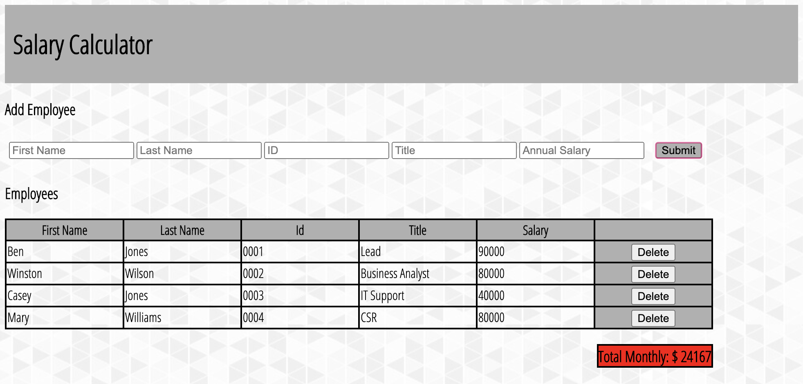

# Jquery Salary Calculator

## Description

_Duration: 20 hours_

This application allows user to add employees to see how much it will cost to pay them.

## Screen Shot

Image should display employees with salary inputs.
If total cost of salary inputs have exceeded this sample company's monthly budget of $20,000.00, alert red on total monthly box.

## Installation

1. Open the index.html onto browser

## Usage

1. Input values onto input fields 
2. Click submit to append employee information onto table
3. Salary of employee will get calculated and added 
onto box that says Total Monthly $
4. Delete appropriate employee if payroll budge is exceeded
(Total Monthly box will light red when company's budget is exceeded)

## Built With

HTML, CSS, JavaScript, Jquery

## Acknowledgement
Thanks to [Prime Digital Academy](www.primeacademy.io) who equipped and helped me to make this application a reality. 

